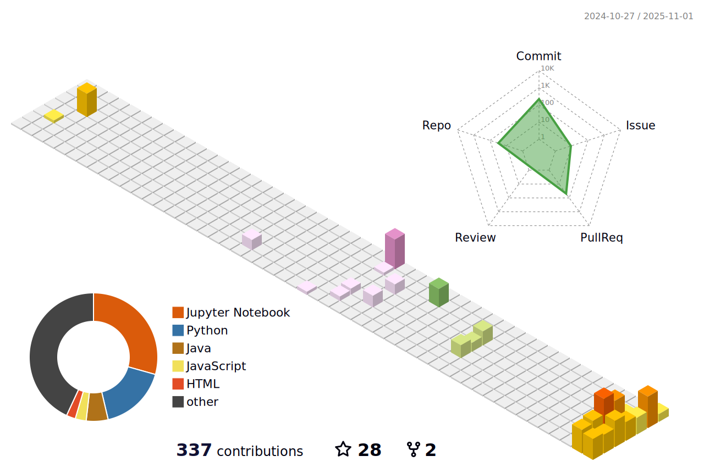

<!-- 

  

 -->

<!--  -->

  
  <!-- Tech Enthusiast | ML | DL | Open Source Contributor | Problem Solver -->
  <b>Tech Enthusiast | ML | DL | Open Source Contributor | Problem Solver</b>
  

  <em>Second-year Mathematics and Computer Science undergraduate based in New Delhi, India 🇮🇳. Passionate about leveraging technology to build scalable and impactful solutions, with a focus on Machine Learning, Deep Learning, Generative Adversarial Networks (GANs), Data Structures & Algorithms, and Open Source.</em>

<!-- 

 -->

               
<!-- 

  

                                                                        -->

<!-- 

  

 -->

##  About Me

<table style="border: none; border-collapse: collapse; width: 100%;">
  <tr>
    <td style="vertical-align: middle; border: none; width: 65%; padding-right: 20px;">

- I began my coding journey in my **first year of college** and quickly developed a passion for **Machine Learning (ML)**, **Problem Solving through DSA**, and **contributing to the open-source community**.  

- My current focus is on **deepening my expertise** in **ML/DL/GANs** and **mastering advanced algorithms**, while also **actively participating in open-source projects**.  

- I believe in **continuous learning**, **innovation**, and **delivering impactful results**.  
  Always exploring new ideas and chasing what truly **inspires** me! 

</td>
    <td align="center" style="border: none; width: 35%;">
      
    </td>
  </tr>
</table>

#  Tech Stack & Skills

Here are some of the technologies and tools I work with:

**Languages:**

  
  
  
  
  
  
  
  
    

**Machine Learning / Deep Learning:**

  
  
  
  
  
  
  

**Tools & Other:**

  
  
  
  
  

<!--  -->
<!-- 
 -->
<!--  -->
<!-- 

 -->

<!--  -->
  
<!--  -->

<!--  -->

<!--  -->
<!--  -->

# 🏆 Hacktoberfest 2025

  <a href="https://www.holopin.io/hacktoberfest2025/userbadge/cmh0yjw1t00oqjm04ur3ewgl3" target="_blank">
    
  </a>
  <a href="https://www.holopin.io/hacktoberfest2025/userbadge/cmhay5mkv0019ji04kzmmlg8l?balloons=true" target="_blank">
    
  </a>
   
  <em>Proud participant in Hacktoberfest 2025!</em>

#  GitHub Stats & Achievements

  
   
  

#  My Activity & Contributions

  

<!-- 

  

 -->

<!-- 

  <picture>
    <source media="(prefers-color-scheme: dark)" srcset="https://raw.githubusercontent.com/Pranay22077/Pranay22077/output/pacman-contribution-graph-dark.svg">
    <source media="(prefers-color-scheme: light)" srcset="https://raw.githubusercontent.com/Pranay22077/Pranay22077/output/pacman-contribution-graph.svg">
    
  </picture>
  
  

  

 -->
#  Contact me

  

  

  

  

