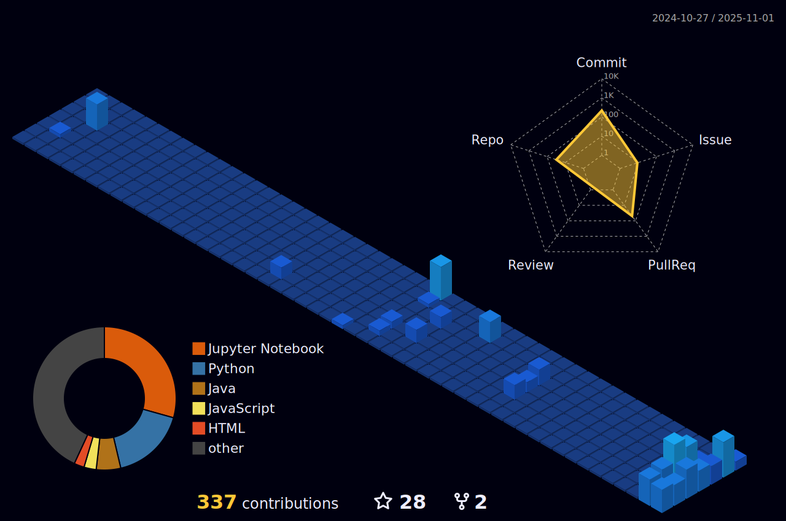

# Hi, I'm Pranay...!

### Tech Enthusiast | ML | DL | Open Source Contributor | Problem Solver

  <em>Second-year Mathematics and Computer Science undergraduate based in New Delhi, India 🇮🇳. Passionate about leveraging technology to build scalable and impactful solutions, with a focus on Machine Learning, Deep Learning, Generative Adversarial Networks (GANs), Data Structures & Algorithms, and Open Source.</em>

  <a href="https://www.linkedin.com/in/pranay22077/" target="_blank">
    
  </a>
  

    

## 💫 About Me

* I began my coding journey in my first year of college and quickly developed a passion for Machine Learning, problem-solving through DSA, and contributing to the open-source community.
* My current focus is deepening my expertise in ML/DL/GANs and mastering advanced algorithms, while also actively participating in open-source projects.
* I believe in continuous learning, innovation, and delivering results. Always exploring new ideas and chasing what inspires me!

---

## Tech Stack & Skills

Here are some of the technologies and tools I work with:

**Languages:**

  
  
  
  
  
  
  
  

**Machine Learning / Deep Learning:**

  
  
  
  
  
  
  

**Tools & Other:**

  
  
  
  

---

## 🏆 Hacktoberfest 2025

  <a href="https://www.holopin.io/hacktoberfest2025/userbadge/cmh0yjw1t00oqjm04ur3ewgl3" target="_blank">
    
  </a>
   
  <em>Proud participant in Hacktoberfest 2025!</em>

---

## GitHub Stats & Achievements

  
  <!-- 
To:  -->
   
  

---

## My Activity & Contributions

  <picture>
    <source media="(prefers-color-scheme: dark)" srcset="https://raw.githubusercontent.com/Pranay22077/Pranay22077/output/pacman-contribution-graph-dark.svg">
    <source media="(prefers-color-scheme: light)" srcset="https://raw.githubusercontent.com/Pranay22077/Pranay22077/output/pacman-contribution-graph.svg">
    
  </picture>
  
  <!--   
    
    -->
  
  

  

