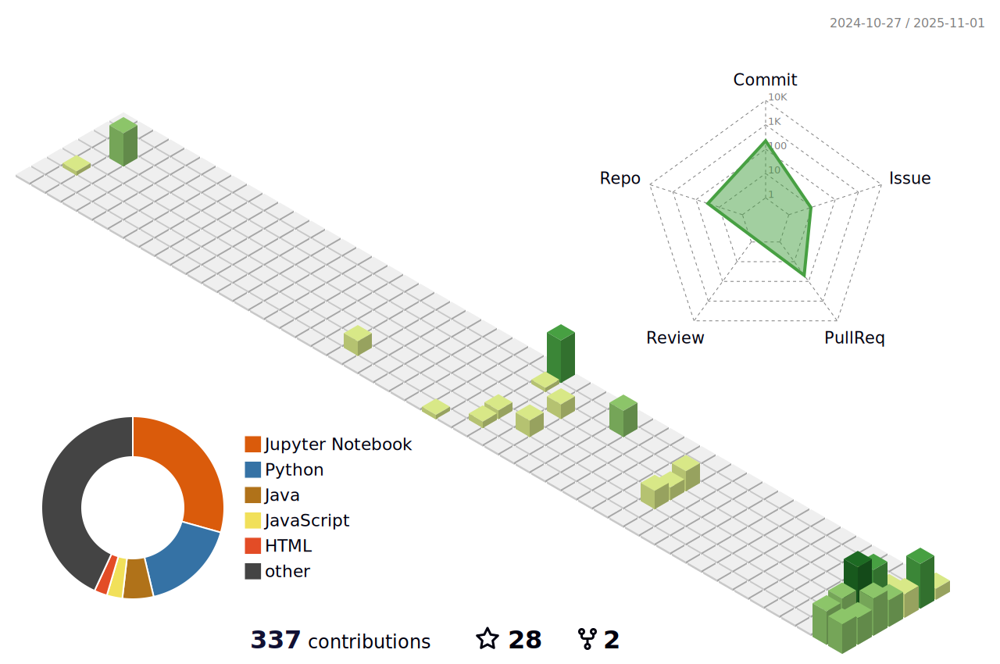

<div align="center">
  
  
  
  
  
  <p align="center">
    
    
    
  </p>

</div>


<p align="center">
  
  <em>Second-year Mathematics and Computer Science undergraduate based in <b>New Delhi, India 🇮🇳</b></em>
  
</p>

<p align="center">
  <em>Passionate about leveraging cutting-edge technology to build <b>scalable</b> and <b>impactful</b> solutions</em><br>
  <em>Specializing in <b>Machine Learning</b>, <b>Deep Learning</b>, <b>GANs</b>, <b>DSA</b>, and <b>Open Source</b></em>
</p>

<div align="center">
  
</div>

##  About Me

<table style="border: none; border-collapse: collapse; width: 100%;">
  <tr>
    <td style="vertical-align: middle; border: none; width: 65%; padding-right: 20px;">

```yaml
name: Pranay
located_in: New Delhi, India
current_focus: 
  - Machine Learning & Deep Learning
  - OpenSource Contributions
  - Data Structures & Algorithms
education: Mathematics & Computer Science (Year 2)
interests: 
  - Building scalable ML solutions
  - Contributing to open source
  - Solving complex algorithmic problems
motto: "Continuous learning, innovation, and impactful results"
```

💡 **Journey Highlights:**
-  Started coding journey in **first year of college**
-  Developed passion for **Machine Learning** and **Problem Solving**
-  Active **open-source contributor** with growing community involvement
-  Currently deepening expertise in **ML/DL/GANs** and **advanced algorithms**
-  Always exploring new ideas and chasing what truly **inspires** me!

</td>
    <td align="center" style="border: none; width: 35%;">
      
    </td>
  </tr>
</table>


##  Currently Working On

```python
current_projects = {
    "learning": ["Advanced Deep Learning Architectures", "GANs and Generative Models", "Advanced DSA Patterns"],
    "building": ["ML-powered applications", "Open source contributions", "Algorithmic solutions"],
    "exploring": ["Computer Vision", "NLP", "Reinforcement Learning"],
    "goal": "Making meaningful impact through technology"
}
```


##  Tech Stack & Skills

<details open>
<summary><b>🔤 Programming Languages</b></summary>
<br>
<p align="left">
  
  
  
  
  
  
  
  
</p>
</details>

<details open>
<summary><b>🤖 Machine Learning / Deep Learning</b></summary>
<br>
<p align="left">
  
  
  
  
  
  
  
  
</p>
</details>

<details open>
<summary><b>🛠️ Tools & Technologies</b></summary>
<br>
<p align="left">
  
  
  
  
  
  
  <a href="https://github.com/Anmol-Baranwal/GIFs-For-Readme"></a>
</p>
</details>

<div align="center">
  
  
  
  
  
  
  
  
</div>


## 🏆 Hacktoberfest 2025 Achievement

<p align="center">
  
</p>

<div align="center">
  
  ### ✨ **Hacktoberfest 2025 Journey** ✨
  <sub>From first PR to Super Contributor - a journey through open source and collaboration</sub>
  
</div>

<div align="center" style="margin: 30px 0;">

  <a href="https://www.holopin.io/hacktoberfest2025/userbadge/cmhcu2l290009jr04dw1xaf5g" target="_blank">
    
  </a>

  ### 🌟 **Super Contributor (Level 5)** 🌟
  
  <p>
    
    
  </p>
  
  <p align="center">
    Among the <strong>5,668 contributors (as of 30/10/2025)</strong> racing towards the <strong>10,000 contributors milestone</strong>!<br/>
    <em>Recognition for consistent and quality open-source contributions throughout Hacktoberfest 2025.</em>
  </p>
  
</div>

<p align="center">
  
</p>

<div align="center">
  
  ### 🎖️ **Badge Collection**
  
  <p align="center">
    <a href="https://www.holopin.io/hacktoberfest2025/userbadge/cmhay5mkv0019ji04kzmmlg8l" target="_blank">
      
    </a>
    <a href="https://www.holopin.io/hacktoberfest2025/userbadge/cmhc4kvjd0069i804ji4f0gt4" target="_blank">
      
    </a>
    <a href="https://www.holopin.io/hacktoberfest2025/userbadge/cmhc4l5tz007rkz049z4mbznm" target="_blank">
      
    </a>
    <a href="https://www.holopin.io/hacktoberfest2025/userbadge/cmhcb58lc008qjo04e5k2vvp3" target="_blank">
      
    </a>
    <a href="https://www.holopin.io/userbadge/cmhcu23z4001tlc0400ptiew7" target="_blank">
      
    </a>
  </p>
  
  <sub>Each badge represents a milestone in continuous learning, teamwork, and giving back to the developer community</sub>
  
</div>


##  GitHub Trophies

<div align="center">
  
</div>


##  GitHub Stats & Achievements

<div align="center">
  
  
</div>

<!-- <div align="center">
   -->
  <!-- 
</div>

 -->

##  My Activity & Contributions

<p align="center">
  
</p>

<div align="center">
  
</div>


##  Let's Connect!

<div align="center">

### 💬 **I'm always open to interesting conversations and collaboration!**

<p align="center">
  <a href="https://www.linkedin.com/in/pranay22077/" target="_blank">
    
  </a>
  <a href="https://x.com/Pranay22077" target="_blank">
    
  </a>
  <a href="https://discord.com/users/1410226708975456336" target="_blank">
    
  </a>
  <a href="https://www.instagram.com/25_pranay_63/" target="_blank">
    
  </a>
</p>

<p align="center">
  <a href="https://www.linkedin.com/in/pranay22077/" target="_blank">
    
  </a>
  <a href="https://x.com/Pranay22077" target="_blank">
    
  </a>
  <a href="https://discord.com/users/1410226708975456336" target="_blank">
    
  </a>
  <a href="https://www.instagram.com/25_pranay_63/" target="_blank">
    
  </a>
</p>

### 📧 **Feel free to reach out for:**
-  Collaboration on ML/DL projects
-  Open source contributions
-  Tech discussions and knowledge sharing
-  Problem-solving and algorithmic challenges

</div>


<div align="center">
  
###  **Random Dev Quote** :)


### 🌟 **Thanks for visiting!** 🌟
  


</div>
