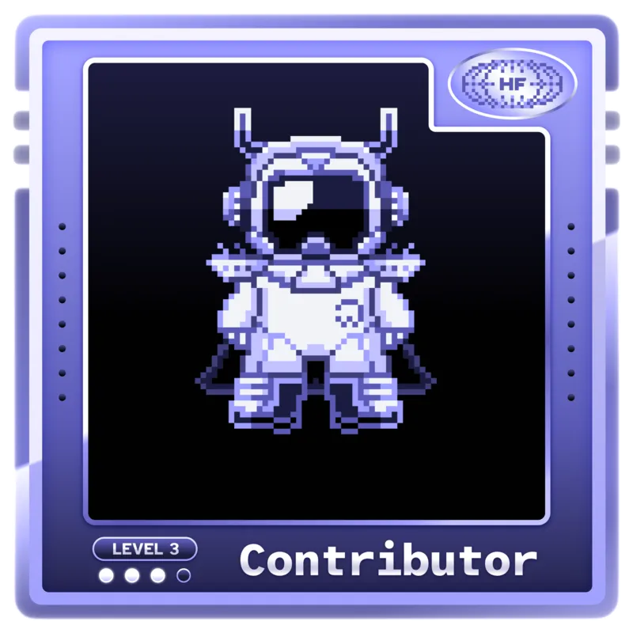
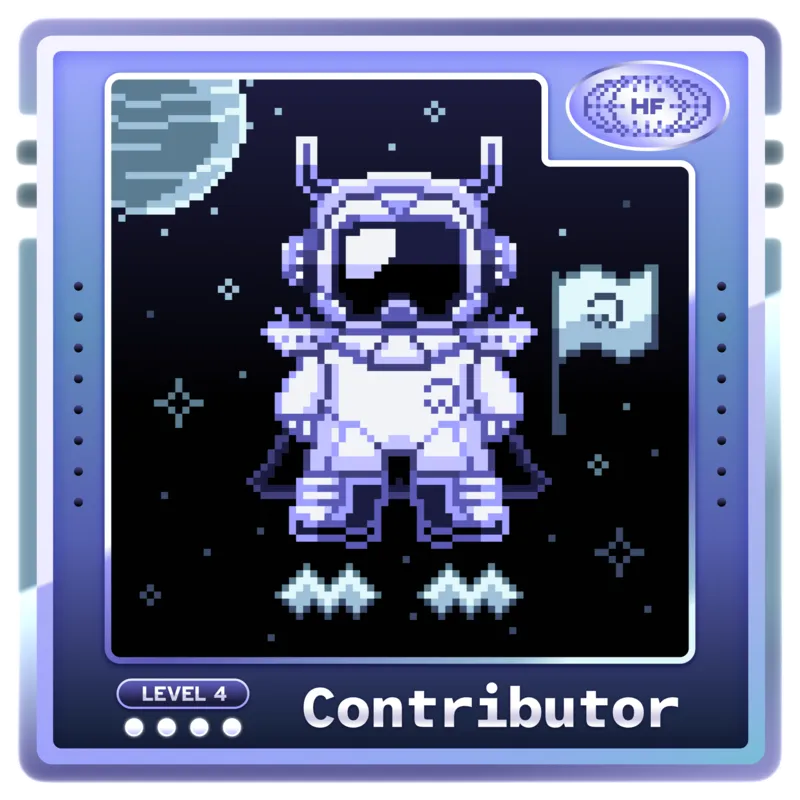
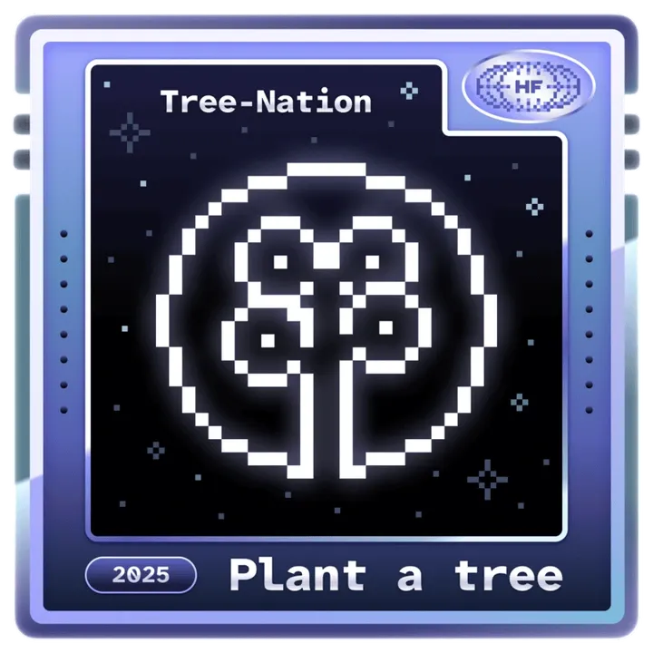

<!-- ═══════════════════════════════════════════════════════════════════════════════ -->
<!--                              ✦ PRANAY'S UNIVERSE ✦                              -->
<!-- ═══════════════════════════════════════════════════════════════════════════════ -->

<div align="center">
  
  <!-- 🌌 Cosmic Header -->
  

  <!-- ✨ Animated Typing Introduction -->
  <br>
  <a href="https://git.io/typing-svg">
    
  </a>

  <!-- 🏷️ Profile Badges -->
  <br><br>
  <a href="https://github.com/Pranay22077">
    
  </a>
  &nbsp;
  <a href="https://github.com/Pranay22077?tab=followers">
    
  </a>
  &nbsp;
  <a href="https://github.com/Pranay22077?tab=stars">
    
  </a>

</div>

<!-- 🌊 Wave Divider -->


<br>

<!-- 📍 Location & Introduction -->
<div align="center">
  <table>
    <tr>
      <td>
        
      </td>
      <td>
        <strong>Second-year Mathematics & Computer Science undergraduate</strong>
      </td>
      <td>
        
      </td>
    </tr>
  </table>
  
  <sub>
    📍 <strong>New Delhi, India</strong> 🇮🇳 &nbsp;|&nbsp; 
    💡 Passionate about <strong>AI/ML</strong>, <strong>Deep Learning</strong>, <strong>GANs</strong> &nbsp;|&nbsp;
    🔥 Building <strong>scalable</strong> & <strong>impactful</strong> solutions
  </sub>
</div>

<br>

<!-- ✨ Decorative Banner -->
<div align="center">
  
</div>

<!-- ═══════════════════════════════════════════════════════════════════════════════ -->
<!--                              ✦ ABOUT ME ✦                                       -->
<!-- ═══════════════════════════════════════════════════════════════════════════════ -->

<br>

<div align="center">
  
  
  
</div>

<br>

<table align="center">
  <tr>
    <td width="55%">

```js
// 🧑‍💻 Pranay's Digital Identity

const pranay = {
    pronouns: "he/him",
    location: "New Delhi, India 🇮🇳",
    education: "B.Sc. Mathematics & Computing",
    
    currentFocus: [
        "🧠 Machine Learning & Deep Learning",
        "🤖 GANs & Generative Models", 
        "🌐 Open Source Contributions",
        "⚡ Data Structures & Algorithms"
    ],
    
    dailyRoutine: {
        morning: "☕ Coffee + Code",
        afternoon: "📚 Learn something new",
        evening: "🔧 Build & Contribute",
        night: "💡 Solve algorithmic challenges"
    },
    
    lifePhilosophy: "Continuous learning → Innovation → Impact 🚀"
};
```

</td>
    <td width="45%" align="center">
      
      <br><br>
      
  <!-- Journey Highlights -->
  <div align="left">
    
  **🎯 Journey Milestones:**
    
  ```diff
  + 🎓 Started coding in Year 1
  + 🤖 Fell in love with ML/AI
  + 🌟 Active OSS contributor
  + 📈 Deepening ML/DL expertise
  + 🚀 Chasing what inspires me!
  ```
    
  </div>
    </td>
  </tr>
</table>

<!-- ✨ Animated Divider -->


<!-- ═══════════════════════════════════════════════════════════════════════════════ -->
<!--                         ✦ CURRENTLY WORKING ON ✦                                -->
<!-- ═══════════════════════════════════════════════════════════════════════════════ -->

<br>

<div align="center">
  <table>
    <tr>
      <td align="center" width="33%">
        
        <br><br>
        <strong>📖 Learning</strong>
        <br><br>
        <code>Deep Learning Architectures</code><br>
        <code>GANs & Generative Models</code><br>
        <code>Advanced DSA Patterns</code>
      </td>
      <td align="center" width="33%">
        
        <br><br>
        <strong>🔨 Building</strong>
        <br><br>
        <code>ML-Powered Applications</code><br>
        <code>Open Source Projects</code><br>
        <code>Algorithmic Solutions</code>
      </td>
      <td align="center" width="33%">
        
        <br><br>
        <strong>🔭 Exploring</strong>
        <br><br>
        <code>Computer Vision</code><br>
        <code>Natural Language Processing</code><br>
        <code>Reinforcement Learning</code>
      </td>
    </tr>
  </table>
</div>

<br>

<div align="center">
  
</div>

<!-- ✨ Animated Divider -->


<!-- ═══════════════════════════════════════════════════════════════════════════════ -->
<!--                         ✦ TECH STACK & SKILLS ✦                                 -->
<!-- ═══════════════════════════════════════════════════════════════════════════════ -->

<br>

<div align="center">
  
  
  
</div>

<br>

<!-- 💻 Programming Languages -->
<details open>
<summary>
  
  <b> Programming Languages</b>
</summary>
<br>
<div align="center">
  
  
  
  
  
  
  
  
  
  
</div>
</details>

<!-- 🤖 Machine Learning / Deep Learning -->
<details open>
<summary>
  
  <b> Machine Learning / Deep Learning</b>
</summary>
<br>
<div align="center">
  
  
  
  
  
  
  
  
  
  
</div>
</details>

<!-- 🔧 Tools & Technologies -->
<details open>
<summary>
  
  <b> Tools & Technologies</b>
</summary>
<br>
<div align="center">
  
  
  
  
  
  
  
  
  <br>
  
  [](https://github.com/Anmol-Baranwal/GIFs-For-Readme)
  
</div>
</details>

<br>

<!-- 🎨 Animated Tech Icons -->
<div align="center">
  
  
  
  
  
  
  
  
</div>

<!-- ✨ Animated Divider -->


<!-- ═══════════════════════════════════════════════════════════════════════════════ -->
<!--                      ✦ HACKTOBERFEST 2025 ACHIEVEMENT ✦                         -->
<!-- ═══════════════════════════════════════════════════════════════════════════════ -->

<br>

<div align="center">
  
</div>

<br>

<!-- 🎆 Celebration Banner -->
<div align="center">
  
</div>

<br>

<div align="center">
  
  <!-- 🏅 Main Achievement Badge -->
  <a href="https://www.holopin.io/hacktoberfest2025/userbadge/cmhcu2l290009jr04dw1xaf5g" target="_blank">
    
  </a>
  
  <br><br>
  
  <!-- ✨ Achievement Title -->
  
  
  <br><br>
  
  <!-- 📊 Stats Badges -->
  
  &nbsp;
  <!-- 
  &nbsp; -->
  
  
  <br><br>
  
  <em>🌟 Among the <strong>elite 5,668 contributors</strong> racing towards the <strong>10,000 milestone</strong>!</em>
  
</div>

<br>

<!-- 🎖️ Badge Collection -->
<div align="center">
  
  <details open>
  <summary><b>🎖️ Complete Badge Collection</b></summary>
  <br>
  
  <table>
    <tr>
      <td align="center">
        <a href="https://www.holopin.io/hacktoberfest2025/userbadge/cmhay5mkv0019ji04kzmmlg8l" target="_blank">
          
        </a>
        <br><sub>Level 1</sub>
      </td>
      <td align="center">
        <a href="https://www.holopin.io/hacktoberfest2025/userbadge/cmhc4kvjd0069i804ji4f0gt4" target="_blank">
          
        </a>
        <br><sub>Level 2</sub>
      </td>
      <td align="center">
        <a href="https://www.holopin.io/hacktoberfest2025/userbadge/cmhc4l5tz007rkz049z4mbznm" target="_blank">
          
        </a>
        <br><sub>Level 3</sub>
      </td>
      <td align="center">
        <a href="https://www.holopin.io/hacktoberfest2025/userbadge/cmhcb58lc008qjo04e5k2vvp3" target="_blank">
          
        </a>
        <br><sub>Level 4</sub>
      </td>
      <td align="center">
        <a href="https://www.holopin.io/hacktoberfest2025/userbadge/cmhcu2l290009jr04dw1xaf5g" target="_blank">
          
        </a>
        <br><sub>Level 5 ⭐</sub>
      </td>
      <td align="center">
        <a href="https://www.holopin.io/userbadge/cmhcu23z4001tlc0400ptiew7" target="_blank">
          
        </a>
        <br><sub>🌳 TreeNation</sub>
      </td>
    </tr>
  </table>
  
  <sub>✨ Each badge represents a milestone in continuous learning, teamwork, and community contribution</sub>
  
  </details>
  
</div>

<br>

<!-- 🎆 Bottom Celebration -->
<div align="center">
  
</div>

<!-- ✨ Animated Divider -->


<!-- ═══════════════════════════════════════════════════════════════════════════════ -->
<!--                           ✦ GITHUB TROPHIES ✦                                   -->
<!-- ═══════════════════════════════════════════════════════════════════════════════ -->

<br>

<div align="center">
  
  
  
</div>

<br>

<div align="center">
  
</div>

<!-- ✨ Animated Divider -->


<!-- ═══════════════════════════════════════════════════════════════════════════════ -->
<!--                      ✦ GITHUB STATS & ACHIEVEMENTS ✦                            -->
<!-- ═══════════════════════════════════════════════════════════════════════════════ -->

<br>

<div align="center">
  
  
  
</div>

<br>

<div align="center">
  
  
</div>

<!-- ✨ Animated Divider -->


<!-- ═══════════════════════════════════════════════════════════════════════════════ -->
<!--                       ✦ ACTIVITY & CONTRIBUTIONS ✦                              -->
<!-- ═══════════════════════════════════════════════════════════════════════════════ -->

<br>

<div align="center">
  
  
  
</div>


<br>

<!-- 🌐 3D Contribution Calendar -->
<div align="center">
  
</div>

<br>

<!-- 📈 Contribution Graph -->
<div align="center">
  
</div>

<!-- ✨ Animated Divider -->


<!-- ═══════════════════════════════════════════════════════════════════════════════ -->
<!--                          ✦ LET'S CONNECT ✦                                      -->
<!-- ═══════════════════════════════════════════════════════════════════════════════ -->

<br>

<div align="center">
  
  
  
</div>

<br>

<div align="center">

  <!-- 💬 Invitation Message -->
  

  <br><br>

  <!-- 🔗 Social Links - Badges -->
  <a href="https://www.linkedin.com/in/pranay22077/" target="_blank">
    
  </a>
  &nbsp;
  <a href="https://x.com/Pranay22077" target="_blank">
    
  </a>
  &nbsp;
  <a href="https://discord.com/users/1410226708975456336" target="_blank">
    
  </a>
  &nbsp;
  <a href="https://www.instagram.com/25_pranay_63/" target="_blank">
    
  </a>

  <br><br>

  <!-- 🎨 Animated Social Icons -->
  <a href="https://www.linkedin.com/in/pranay22077/" target="_blank">
    
  </a>
  &nbsp;&nbsp;
  <a href="https://x.com/Pranay22077" target="_blank">
    
  </a>
  &nbsp;&nbsp;
  <a href="https://discord.com/users/1410226708975456336" target="_blank">
    
  </a>
  &nbsp;&nbsp;
  <a href="https://www.instagram.com/25_pranay_63/" target="_blank">
    
  </a>

</div>

<br>

<!-- 📧 Reach Out Section -->
<div align="center">
  
  **📧 Feel free to reach out for:**
  
  <table>
    <tr>
      <td align="center">🤖</td>
      <td>Collaboration on <strong>ML/DL projects</strong></td>
    </tr>
    <tr>
      <td align="center">🌐</td>
      <td><strong>Open source</strong> contributions</td>
    </tr>
    <tr>
      <td align="center">💡</td>
      <td>Tech discussions & <strong>knowledge sharing</strong></td>
    </tr>
    <tr>
      <td align="center">🧩</td>
      <td><strong>Problem-solving</strong> & algorithmic challenges</td>
    </tr>
  </table>
  
</div>

<!-- ✨ Animated Divider -->


<!-- ═══════════════════════════════════════════════════════════════════════════════ -->
<!--                             ✦ FOOTER ✦                                          -->
<!-- ═══════════════════════════════════════════════════════════════════════════════ -->

<br>

<div align="center">
  
  <!-- 💭 Random Dev Quote -->
  

  <br><br>

  

</div>

<br>

<!-- ✨ Final Animation -->


<br>

<!-- 🙏 Thank You Section -->
<div align="center">
  
  

  <br><br>

  <!-- ⭐ Star Request -->
  <sub>
    <em>If you found my profile interesting, consider giving a ⭐ to my repositories!</em>
  </sub>

  <br><br>

  <!-- 📊 Made with Love
  
  &nbsp;
   -->

</div>

<br>

<!-- 🌊 Footer Wave -->


<!-- ═══════════════════════════════════════════════════════════════════════════════ -->
<!--                        ✦ END OF PRANAY'S PROFILE ✦                              -->
<!-- ═══════════════════════════════════════════════════════════════════════════════ -->
